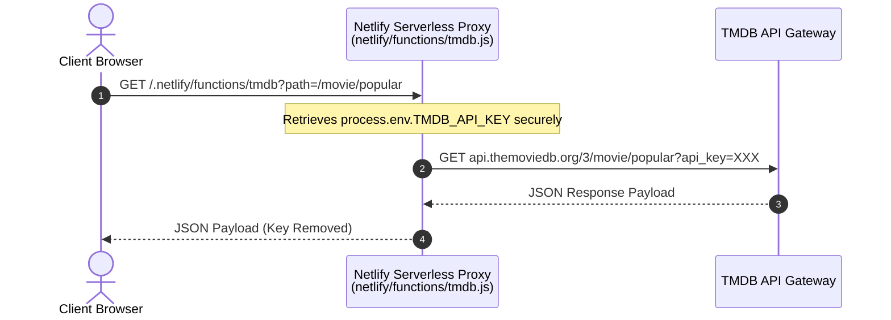

#  Netflix Clone (Serverless Proxy Edition)

[](https://app.netlify.com/sites/nettflix-clone-mukund/deploys)
[](https://nettflix-clone-mukund.netlify.app)
[](https://github.com/Mukund2007/NETFLIX_CLONE)
[](https://opensource.org/licenses/MIT)

A high-fidelity, production-grade recreation of the **Netflix user experience** built using vanilla frontend technologies. 

To address the security vulnerability of exposing the private TMDB API key to the client browser, this project integrates a **Netlify Serverless Function** backend proxy. All TMDB data requests are processed server-side, securing backend API communications.

---

## 📸 Interface Preview

<div align="center">
  
  <p><i>Premium dark-mode layouts, micro-interactive components, and responsive typography designed to replicate the original desktop & mobile Netflix streams.</i></p>
</div>

---

## ✨ Features

*   **🎬 Dynamic Hero Engine**: Picks fresh releases from TMDB, showing high-res backdrops, matched percentage, maturity ratings, and synopses.
*   **📂 Multi-Category Rails**: Horizontal scrolling rows loaded dynamically (Trending Today, Action Thrillers, Sci-Fi Specials, Horror, Romance, etc.).
*   **🔍 Interactive Live Search**: Real-time filtering with a responsive, smooth-loading movie grid as you type.
*   **🔔 Dropdown Notifications**: Interactive system alerts showing new releases, trailers, and saved list modifications.
*   **🎭 Profiles & Kids Mode**: Interactive profile menu featuring a custom-themed Kids Mode filter showing family-friendly content.
*   **📱 Universal Responsiveness**: Optimizations for mobile screen widths, using interactive overlays and a hamburger drawer menu.
*   **🌟 High Fidelity Modal**: Clicking any card slides up a comprehensive screen details overlay containing cast, genre breakdowns, video trailers, and dynamic recommendations.
*   **🍞 Netflix-Style Toasts**: Subtle alert micro-animations appearing for watchlist notifications.

---

## 🛠️ Tech Stack & Badges

### Frontend Core
- 
- 
- 

### Serverless & Build Tools
- 
- 
- 
- 

---

## 🔒 Serverless Security Architecture

Historically, storing a `TMDB_API_KEY` on the client side inside static configs (`config.js`) exposes your credentials inside the browser's DevTools "Sources" panel, inviting API quota theft.

This project implements a **secure backend proxy** to solve this issue:



**Outcome**: The private API key remains on the server and is never sent to, or visible in, the user's web browser.

---

## 📁 Repository Structure

```
NETFLIX_CLONE/
├── netlify/
│   └── functions/
│       └── tmdb.js          # Node.js 18+ Serverless Proxy Function
├── index.html               # Main HTML Template (Critical CSS inline)
├── app.js                   # Client-side Core Logic (unminified dev build)
├── app.min.js               # Optimized & Mangled Production JavaScript
├── style.css                # Style sheets containing animations
├── style.min.css            # Minified and compressed CSS for fast loading
├── package.json             # Build script minification config
├── netlify.toml             # Netlify Build and Functions routing map
└── .gitignore               # Ignored system dependencies (node_modules, keys)
```

---

## 🚀 Local Quickstart

### Prerequisites
Make sure you have **Node.js** (v18+) and **NPM** installed.

### 1. Clone the repository
```bash
git clone https://github.com/Mukund2007/NETFLIX_CLONE.git
cd NETFLIX_CLONE
```

### 2. Install Development Dependencies
```bash
npm install
```

### 3. Build & Minify Files
To compile the raw JS/CSS modifications into high-performance distribution folders, run:
```bash
npm run build
```

### 4. Running Serverless Functions Locally
To run the serverless function proxy locally, use the **Netlify CLI**:
```bash
# Install Netlify CLI globally
npm install -g netlify-cli

# Fire up Netlify Dev server (emulates production functions)
netlify dev
```
Open [http://localhost:8888](http://localhost:8888) to test the website locally.

---

## ⚙️ Environment Variables Config

To deploy or host this clone, configure a private TMDB key in your hosting environment:

| Variable | Description | Source |
| :--- | :--- | :--- |
| `TMDB_API_KEY` | Private v3 credentials key from TMDB accounts panel | [TheMovieDB API Docs](https://www.themoviedb.org/settings/api) |

### Netlify Deployment Configuration:
1. Navigate to **Site configuration** ➔ **Environment variables**.
2. Add a variable with the key `TMDB_API_KEY` and paste your private API key as its value.
3. Save changes and trigger a redeployment.

---

## 🎬 Credits & Data Sources

- Powered by [The Movie Database (TMDB) API](https://www.themoviedb.org/).
- UI Inspiration, assets, and styling trademarks are copyright & property of **Netflix Inc.**
- Created as a dynamic portfolio optimization project.
